## 一、实验要求

> **1.**  **生成式人工智能（AIGC）的算法实现与应用。编程语言不限，具体算法与应用不限。对模型训练不做要求，会调用预训练好的模型即可。**
>
> **2.**  **介绍所选择模型的算法原理，填写在\*`三、实验原理`\*部分。**
>
> **3.**  **介绍所选择project的推理过程、各文件的功能与关系等，截图运行结果并分析。填写在\*`四、实验内容`\*部分。**
>
> **4.**  **每组提交一个实验报告，简述组员贡献，说明贡献占比。填写在\*`五、贡献占比`\*部分。**
>
> **5.**  **报告命名为`实验四实验报告_组长学号_组长姓名.pdf`,并于2023年6月20日23:59前提交到**https://send2me.cn/aYipHM4I/Sfe8by0H-CGW5w**。**

## 二、实验环境及实验数据集

- **实验环境**
  - 软件环境：
    - Python 3.10.5
    - CUDA：11.6
    - Stable Diffusion v1
  - 硬件环境：
    - CPU: Intel Core i5-12490F 6C12T
    - GPU: RTX 2070 8G
    - RAM: 32G DDR4 3200MHz
  
- **GitHub地址**
  - [AUTOMATIC1111/stable-diffusion-webui: Stable Diffusion web UI (github.com)](https://github.com/AUTOMATIC1111/stable-diffusion-webui)

## 三、实验原理

### 原理解释

Stable Diffusion是一种深度学习模型。属于一类称为扩散模型（diffusion model）的深度学习模型。它们是生成模型，这意味着它们的目的是生成类似于它们训练数据的新数据。对于Stable Diffusion来说，数据就是图像。它被称为扩散模型是因为：它的数学看起来很像物理学中的扩散。	

**用下面的例子来解释扩散的理念。**

- 假设我训练了一个只有两种图像的扩散模型：猫和狗。在下图中，左边的两个堆代表猫和狗这两组图像。

  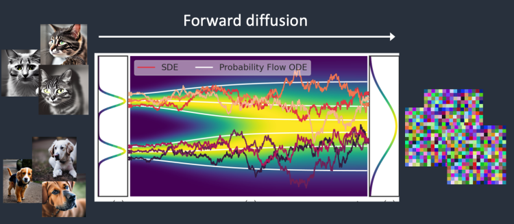

之后通过**前向扩散**过程将噪声添加到训练**图像**中，逐渐将其**转换为**没有特点的**噪声**图像。前向过程会将任何猫或狗的图像变成噪声图像。最终，您将无法分辨它们最初是狗还是猫。就像一滴墨水掉进了一杯水里。墨滴在水中**扩散**。几分钟后，它会随机分布在整个水中。你再也分不清它最初是落在中心还是边缘附近。

- 下面是一个进行前向扩散的图像示例。猫的图像变成随机噪音。
  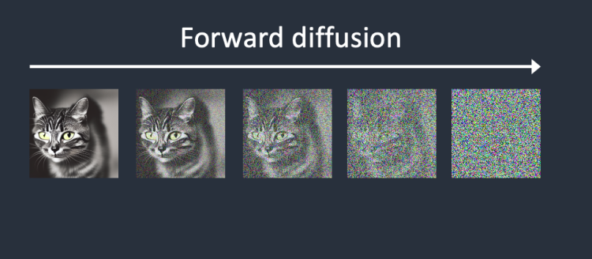

- 而如果我们能逆转扩散呢？就像向后播放视频一样。时光倒流。我们将看到墨滴最初添加的位置。
  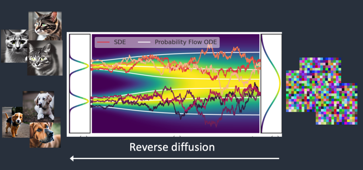

从嘈杂、无意义的图像开始，反向扩散恢复了猫或狗的图像。这是主要思想。从技术上讲，每个扩散过程都有两部分：（1）漂移或定向运动和（2）随机运动。反向扩散向猫或狗的图像漂移，但两者之间没有任何变化。这就是为什么结果可以是猫或狗。

### 如何训练

为了反向扩散，我们需要知道图像中添加了多少噪声。方法是教神经网络模型来预测增加的噪声。它被称为Stable Diffusion中的**噪声预测因子（noise predictor）**。这是一个U-Net模型。

> U-Net模型是一种用于图像分割的深度学习模型，最初由Olaf Ronneberger、Philipp Fischer和Thomas Brox在2015年提出。它的设计目标是解决医学图像分割任务中的像素级别预测问题。
>
> U-Net模型的结构由一个对称的U形网络组成，因此得名。它具有编码器-解码器的结构，其中编码器用于捕捉图像中的上下文信息，而解码器则用于恢复分辨率并生成密集的预测。

训练过程如下 ：

1. 选择一个训练图像，例如猫的照片。
2. 生成随机噪声图像。
3. 通过将此噪声图像添加到一定数量的step来损坏训练图像。
4. 训练噪声预测器告诉我们添加了多少噪声。这是通过调整其权重并向其显示正确答案来完成的。

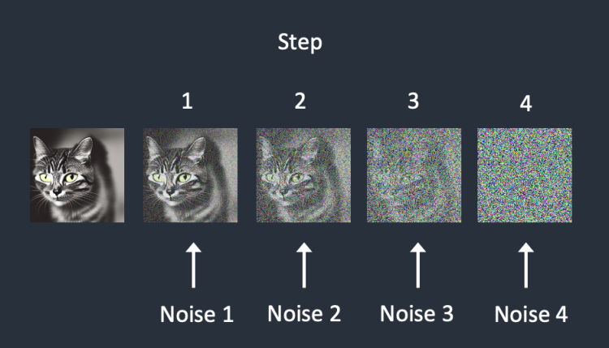

> 噪声在每一步按顺序添加。噪声预测器估计每个step加起来的总噪声。

训练后，我们就得到了一个噪声预测器，能够估计添加到图像中的噪声。

### 使用噪声预测器进行Reverse diffusion

我们首先生成一个完全随机的图像，并要求**噪声预测器告诉我们噪声**。然后，我们从原始图像中**减去这个估计的噪声**。重复此过程几次。你会得到一只猫或一只狗的图像。

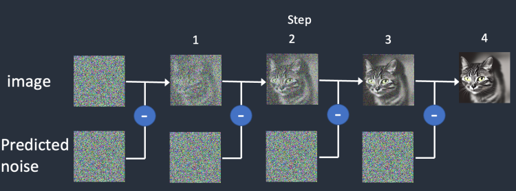

现在我们无法控制生成猫或狗的图像。当我们谈论**conditioning**时，我们将解决这个问题。目前，图像生成是**unconditioned**。

### Stable Diffusion Model

但是刚才谈论的不是Stable Diffusion的工作原理，原因是上述扩散过程是在图像空间中。它在计算上非常非常慢。 图像空间是巨大的。具有三个颜色通道（红色、绿色和蓝色）的 512×512 图像就是一个 786,432 维的空间。

#### Latent diffusion model

Stable Diffusion旨在解决扩散模型的速度问题。方法如下：
Stable Diffusion**是一种在潜在空间扩散（latent diffusion）的模型**。它不是在高维图像空间中操作，而是首先将图像压缩到**潜空间（latent space）**中。对比原像素空间，潜空间（**latent space**）小了 48 倍，因此它获得了处理更少数字的好处，这就是为什么它要快得多。

#### Variational Autoencoder

Stable Diffusion使用一种称为**变分自编码器**（Variational Autoencoder）的技术来实现图像潜空间压缩。这正是我们在使用Stable Diffusion时设置的VAE文件的内容。变分自编码器（VAE：Variational Autoencoder）神经网络由两部分组成：（1）编码器和（2）解码器。编码器将图像压缩为潜在空间中的低维表示。解码器从潜在空间恢复图像。

> [VAE文件](https://link.zhihu.com/?target=https%3A//stable-diffusion-art.com/how-to-use-vae/)在Stable Diffusion v1中使用，以改善眼睛和面部的绘画效果。它们是**自编码器的解码器**。通过进一步微调解码器，模型可以绘制更精细的细节。将图像压缩到潜在空间中**确实会丢失信息**，因为原始VAE无法恢复精细细节。相反，VAE解码器负责在解码的时候**绘制**精细的细节。

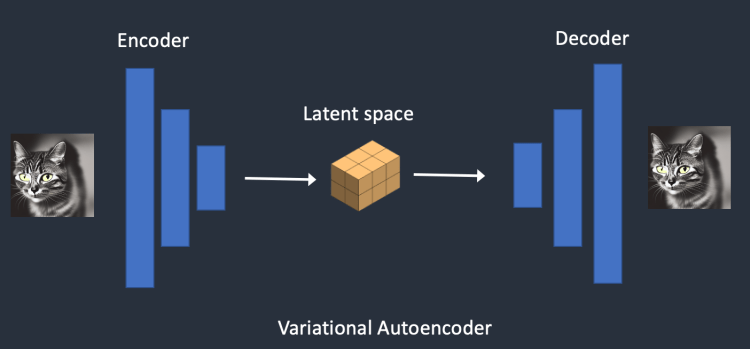

**Stable Diffusion模型的潜空间为4x64x64，比图像像素空间小48倍。**我们谈到的所有正向和反向扩散实际上是在潜在空间中完成的。因此，在训练过程中，**它不会生成噪声图像，而是在潜在空间中生成随机张量（潜在噪声）**。它不是用噪声破坏图像，而是用潜在噪声破坏图像在潜在空间中的表示。**这样做的原因是它的速度要快得多，因为潜在空间更小。**

为什么VAE可以将图像压缩到更小的潜在空间而不会丢失信息？原因是，自然图像**不是随机的**。它们具有很高的规律性：面部遵循眼睛、鼻子、脸颊和嘴巴之间的特定空间关系。狗有 4 条腿，是一种特殊的形状。

换句话说，图像的高维性是伪影。自然图像可以很容易地压缩到更小的潜在空间中，而不会丢失任何信息。这在机器学习中被称为[流形假设](https://link.zhihu.com/?target=https%3A//en.wikipedia.org/wiki/Manifold_hypothesis)([manifold hypothesis](https://link.zhihu.com/?target=https%3A//en.wikipedia.org/wiki/Manifold_hypothesis))。

#### Image resolution

图像分辨率反映在潜在图像张量的大小上。潜在图像的大小仅为 4x64x64，仅适用于 512×512 图像。对于 4×96 的纵向图像，它是 64x768x512。这就是为什么生成更大的图像需要更多的VRAM的原因。

#### 潜空间中的反向扩散

以下是Stable Diffusion中潜在反向扩散的工作原理。

1. 生成随机潜在空间矩阵。
2. 噪声**预测器**估计潜在矩阵的噪声。
3. 然后从原始潜空间矩阵中减去估计的噪声。
4. 重复步骤 2 和 3 直至特定采样步骤。
5. VAE的**解码器**将潜空间矩阵转换为最终图像。

### Conditioning

文本提示（text prompt）在哪里注入到图片？没有这部分内容，Stable Diffusion就不是文本到图像（text-to-image）模型。你会随机得到一只猫或一只狗的图像，但你没法控制Stable Diffusion为你生成猫或者狗的图像。
这就是条件**(conditioning)**的用武之地。条件的目的是**引导噪声预测器**，**以便预测的噪声在从图像中减去后会给出我们想要的东西**。

#### Text conditioning

下面概述了**如何处理文本提示（**Text Prompt**）**并将其输入噪声预测器。**分词器（**Tokenizer**）**首先将提示中的每个单词转换为称为**标记（**token**）**的数字。然后将每个标记转换为称为Embedding的 768 值向量。（这与Web界面中使用的**Embedding**相同）然后，Embedding由**文本转换器**处理，并准备好供噪声预测器使用。

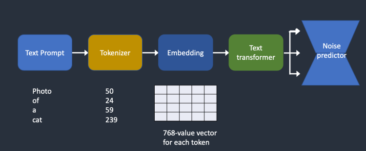

#### **tokenizer**

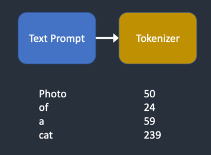

文本提示首先由 [CLIP 标记器](https://link.zhihu.com/?target=https%3A//huggingface.co/docs/transformers/model_doc/clip)**进行标记化**。CLIP是由Open AI开发的深度学习模型，用于生成任何图像的文本描述。Stable Diffusion v1使用CLIP的分词器。
**令牌化（Tokenization）**是计算机理解单词的方式。我们人类可以阅读单词，但计算机只能读取数字。这就是为什么文本提示中的单词首先转换为数字的原因。

分词器只能对它在训练期间看到的单词进行分词。例如，CLIP 模型中有“dream”和“beach”，但没有“dreambeach”。Tokenizer将“dreambeach”这个词分解为两个标记“dream”和“beach”。所以一个**词并不总是意味着一个令牌**！

另一个细则是空格字符也是令牌（token）的一部分。在上述情况下，短语“dream beach”产生两个标记“dream ”和“[空格]beach”。这些token与“dreambeach”产生的token不同，“dream beach”是“dream”和“beach”（beach前没有空格）。
Stable Diffusion模型仅限于在提示中使用 75 个令牌。（它和75个字不一样了）

#### **Embedding**

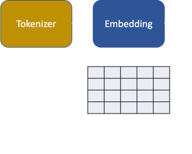

Stable Diffusion v1 使用 Open AI 的 [ViT-L/14](https://link.zhihu.com/?target=https%3A//github.com/CompVis/stable-diffusion) 剪辑模型。嵌入是一个 768 个值的向量。每个令牌都有自己唯一的嵌入向量。嵌入由 CLIP 模型固定，该模型是在训练期间学习的。
为什么我们需要嵌入（Embedding）？这是因为有些词彼此密切相关。我们希望利用这些信息。例如，*man*、*gentleman* 和 *guy* 的嵌入几乎相同，因为它们可以互换使用。莫奈、马奈和德加都以印象派风格作画，但方式不同。这些名称具有接近但不相同的嵌入。这与我们讨论的用于触发带有关键字的样式的[嵌入](https://link.zhihu.com/?target=https%3A//stable-diffusion-art.com/embedding/)相同。嵌入可以产生魔力。科学家们已经证明，找到合适的嵌入可以触发任意的对象和样式，这是一种称为[文本反转](https://link.zhihu.com/?target=https%3A//textual-inversion.github.io/)的微调技术。

#### 将**embeddings**馈送到noise predictor

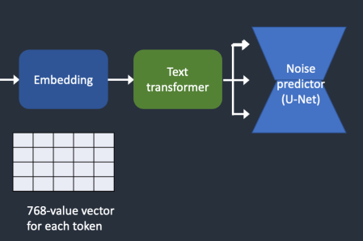

在馈入噪声预测器之前，**文本转换器**需要进一步处理嵌入。变压器就像一个用于调节的通用适配器。在这种情况下，它的输入是文本嵌入向量，但它也可以是其他东西，如类标签、图像和[深度图](https://link.zhihu.com/?target=https%3A//stable-diffusion-art.com/depth-to-image/)。转换器不仅进一步处理数据，而且还**提供了一种包含不同调节模式的机制**。

#### Cross-attention

文本转换器的输出由整个 U-Net 中的噪声预测器**多次**使用。U-Net通过**交叉注意力机制**消耗它。这就是提示与图像相遇的地方。

让我们以提示“蓝眼睛的男人”为例。Stable Diffusion将“蓝色”和“眼睛”这两个词配对在一起（提示中的自注意力机制），这样它就会生成一个蓝眼睛的男人，而不是一个蓝衬衫的男人。然后，它使用这些信息将反向扩散引导到包含蓝眼睛的图像。（提示/prompt和图像/image之间的交叉注意力机制）

> Hypernetwork是一种微调Stable Diffusion的技术，它通过干预交叉注意力网络来插入样式。
>
> LoRA 模型修改交叉注意力模块的权重以更改样式。仅修改此模块就可以微调 Stabe Diffusion模型这一事实说明了该模块的重要性。
>
> ControlNet 通过检测到的轮廓、人体姿势等来调节噪声预测器，并实现对图像生成的出色控制。

### Stable Diffusion Step-by-Step

#### Text-to-image

在文本到图像中，向Stable Diffusion提供文本提示（prompt），它会返回一个图像。

- **第 1 步**。Stable Diffusion在潜空间中生成随机张量。您可以通过设置随机数生成器的[种子](https://link.zhihu.com/?target=https%3A//stable-diffusion-art.com/know-these-important-parameters-for-stunning-ai-images/%23Seed)来控制此张量。如果将种子设置为某个值，您将始终获得相同的随机张量。**这是你在潜在空间中的图像**。但现在都是噪音。
  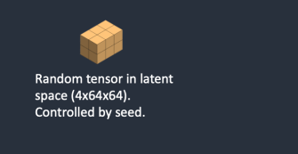
- **第 2 步**。噪声预测器 U-Net 将潜在噪声图像和文本提示作为输入，并**预测**噪声，也在潜在空间（4x64x64 张量）中。
  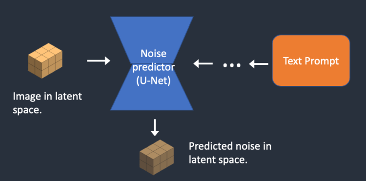
- **第 3 步**。从潜在图像中减去潜在噪声。这将成为您的**新潜在图像**。
  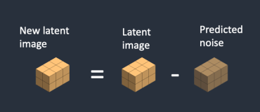
- **第 4 步**，步骤 2 和 3 重复一定数量的采样步骤，例如 20 次。
- **第 5 步**，VAE的解码器将潜在图像转换回像素空间。这是运行Stable Diffusion后获得的图像。
  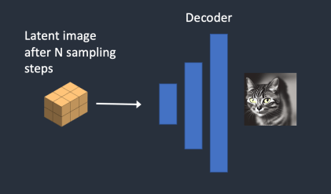
- 点击该链接可查看如何在每个采样步骤中对映像演变进行成像。https://i0.wp.com/stable-diffusion-art.com/wp-content/uploads/2022/12/cat_euler_15.gif?resize=512%2C512&ssl=1

#### Noise schedule

图像从嘈杂变为干净。您是否想知道噪声预测器在初始步骤中是否运行良好？实际上，这只是部分原因。真正的原因是我们试图在每个采样步骤中获得**预期的噪声**。这称为**噪声时间表**。下面是一个示例。

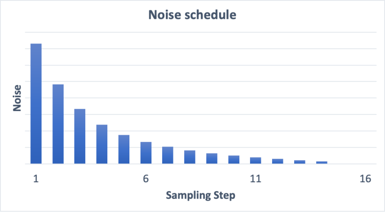

噪音时间表是我们定义的。我们可以选择在每一步减去相同数量的噪声。或者我们可以在开始时减去更多，就像上面一样。**采样器**在每个步骤中减去足够的噪声，以达到下一步中的预期噪声。这就是在step-by-step图像中看到的内容。

### CFG值

#### Classifier Guidance

[分类器引导](https://link.zhihu.com/?target=https%3A//arxiv.org/abs/2105.05233)是一种在扩散模型中合并**图像标签**的方法。您可以使用标签来指导扩散过程。例如，标签“猫”引导反向扩散过程生成猫的照片。

**分类器指导强度（classifier guidance scale）**是用于控制扩散过程应与标签保持多近的参数。

假设有 3 组带有标签“猫”、“狗”和“人类”的图像。如果扩散是无指导的，模型将从每个组的总数据中均匀提取样本，但有时它可能会绘制适合两个标签的图像，例如男孩抚摸狗。

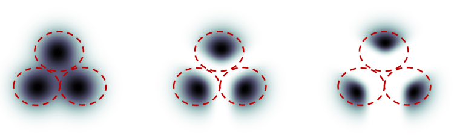

在**高分类器指导下**，扩散模型生成的图像将偏向**极端或明确的例子**。如果你向模型询问一只猫，它将返回一个明确的猫的图像，没有别的。
**分类器指导强度（classifier guidance scale）**控制遵循指导（guidance）的紧密程度。在上图中，右侧的采样具有比中间的分类器指导量表更高的分类器指导量表。实际上，此刻度值只是具有该标签的数据的漂移项的乘数。

#### Classifier-free guidance

尽管分类器指导实现了破纪录的性能，但它需要一个额外的模型来提供该指导。这给培训带来了一些困难。
用作者的话来说，无分类器指导是一种实现“没有分类器的**[分类器指导](https://link.zhihu.com/?target=https%3A//arxiv.org/abs/2207.12598)**”的方法。他们没有使用类标签和单独的模型作为指导，而是建议使用图像标题并训练一个**条件扩散模型**，就像我们在文本到图像中[讨论](https://link.zhihu.com/?target=https%3A//stable-diffusion-art.com/how-stable-diffusion-work/%23Text_conditioning_text-to-image)的那样。
他们将分类器部分作为**噪声预测器U-Net的条件**，在图像生成中实现所谓的“无分类器”（即没有单独的图像分类器）指导。
文本提示以文本到图像的形式提供此指导。

#### CFG 值

现在我们通过条件反射有一个无分类器的扩散过程，我们如何控制应该遵循多少指导？
**无分类器引导 （CFG） 刻度是一个值，用于控制文本提示对扩散过程的调节程度**。当图像生成设置为 0 时，图像生成是**无条件**的（即忽略提示）。较高的值将扩散引导向提示。

## 四、实验内容

### 模型部署与文件介绍

1. 首先电脑要安装python（3.10以上）、git、cuda，之后将项目从[AUTOMATIC1111/stable-diffusion-webui: Stable Diffusion web UI (github.com)](https://github.com/AUTOMATIC1111/stable-diffusion-webui)上pull下来

   **目录结构如下：**
   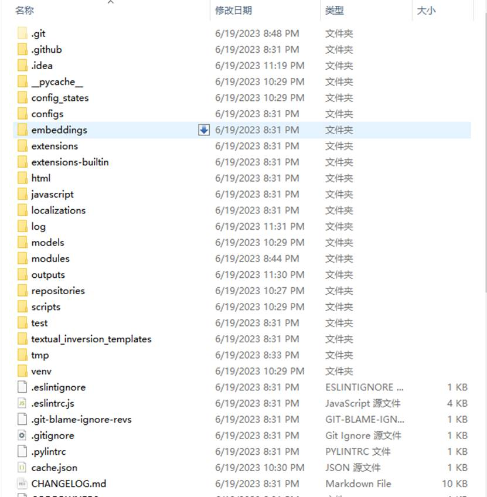
   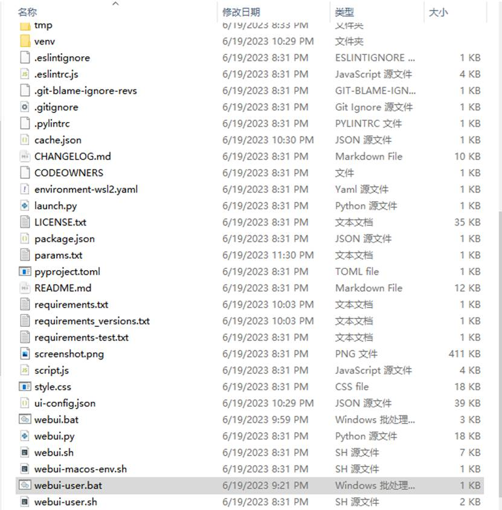

2. 在models/Stable-diffusion目录下，导入权重文件sd-v1-4.ckpt，导入需要的模型文件chilloutmix_NiPrunedFp32Fix.safetensors
   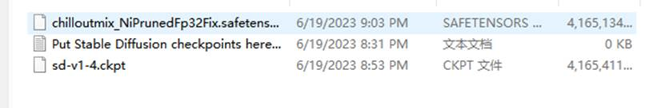

3. 需要安装的包在requirements.txt中罗列，运行webui-user.bat时会自动下载
   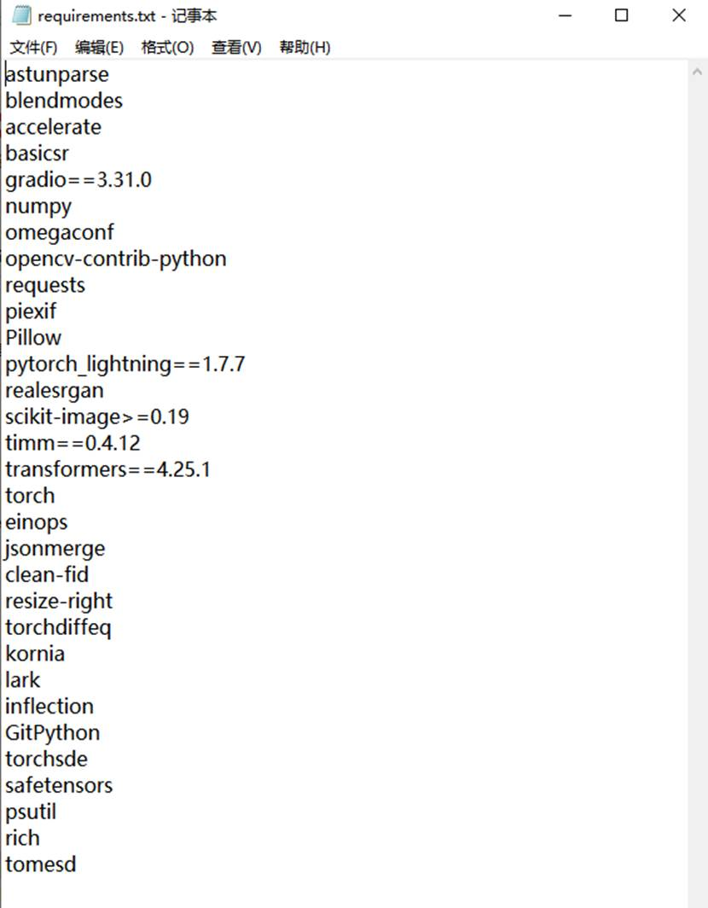

4. 点击webui-user.bat启动
   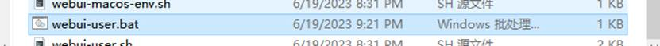

5. 成功，在http://127.0.0.1:7860访问web端
   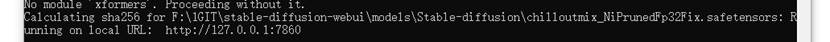

### 参数：

#### 主要参数

参数在前面的实验原理部分已经有所解释，在此进行进一步介绍。我们在web端可以直接调节参数控制图片输出，以输出自己期望的效果。

##### Prompt与Negative prompt

| 参数            | 说明                 |
| --------------- | -------------------- |
| Prompt          | 提示词（正向）       |
| Negative prompt | 消极的提示词（反向） |

> 如果不知道怎么取prompt可以参考 https://prompthero.com/ 上的内容
> 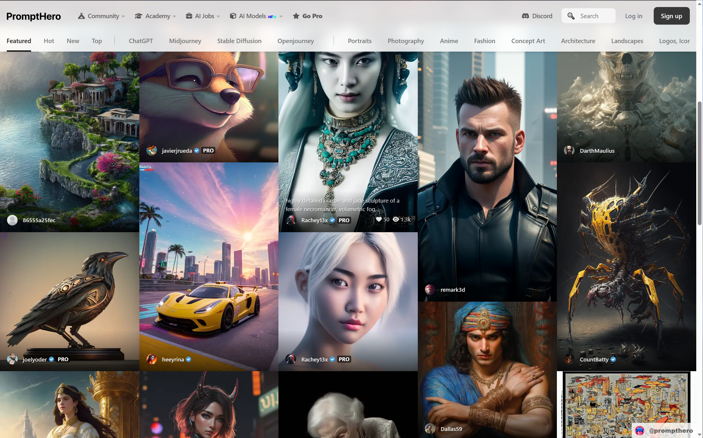
>
> 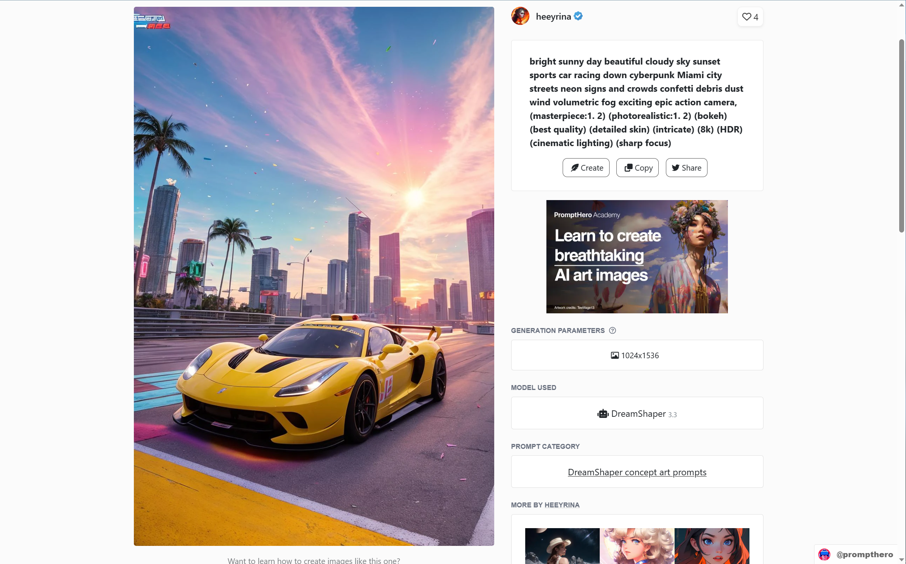
>
> 上面有一些示例图片和相应的prompt取值，可以作为参考

- 首次输入

  `Prompt：an ultra detailed beautiful painting landscape ancient, pyramid, egyptian gods, sun, centered, intricate, by conrad roset, greg rutkowski and makoto shinkai, trending on artstation, Realistic, Cinematic`

  `Negative prompt：an ultra detailed beautiful painting landscape ancient, pyramid, egyptian gods, sun, centered, intricate, by conrad roset, greg rutkowski and makoto shinkai, trending on artstation, Realistic, Cinematic`

  其余参数如图所示：
  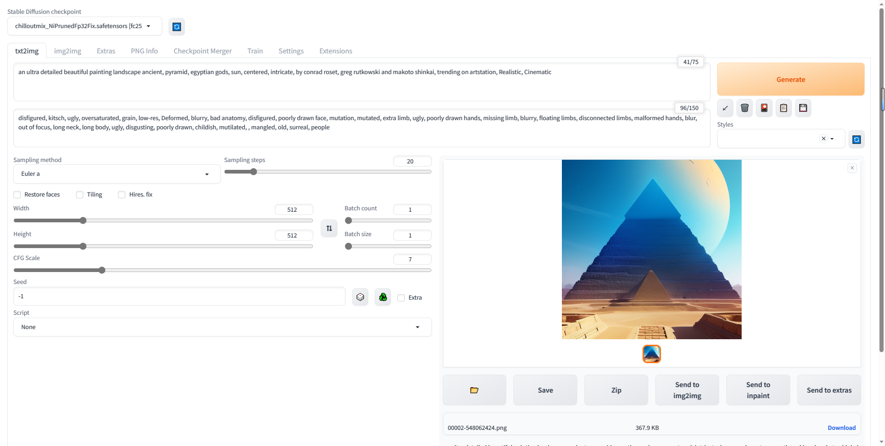

- 去掉Prompt中的pyramid, egyptian gods，我不希望画面中出现埃及金字塔
  `Prompt：an ultra detailed beautiful painting landscape ancient, sun, centered, intricate, by conrad roset, greg rutkowski and makoto shinkai, trending on artstation, Realistic, Cinematic`

  `Negative prompt：an ultra detailed beautiful painting landscape ancient, pyramid, egyptian gods, sun, centered, intricate, by conrad roset, greg rutkowski and makoto shinkai, trending on artstation, Realistic, Cinematic`

  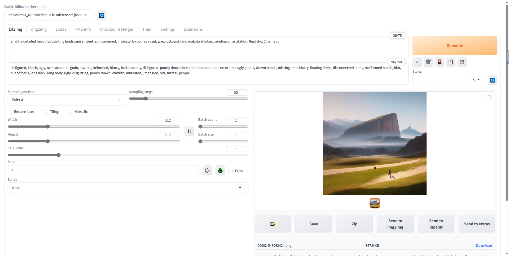
  **输出的图像中就不含有金字塔和埃及风格了。**

- 保留原有的Prompt，去掉所有的Negative prompt

  `Prompt：an ultra detailed beautiful painting landscape ancient, pyramid, egyptian gods, sun, centered, intricate, by conrad roset, greg rutkowski and makoto shinkai, trending on artstation, Realistic, Cinematic`

  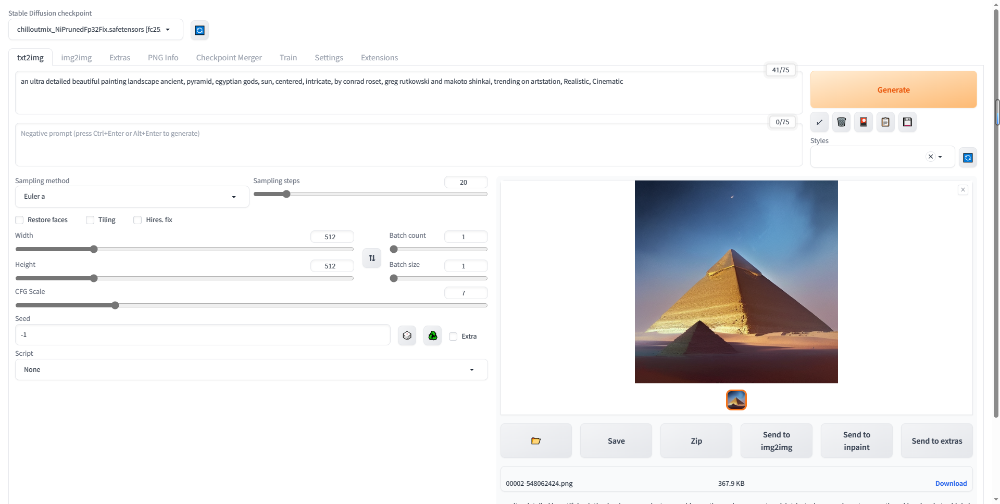

- 用同样的Prompt再次生成

- `Prompt：an ultra detailed beautiful painting landscape ancient, pyramid, egyptian gods, sun, centered, intricate, by conrad roset, greg rutkowski and makoto shinkai, trending on artstation, Realistic, Cinematic`

  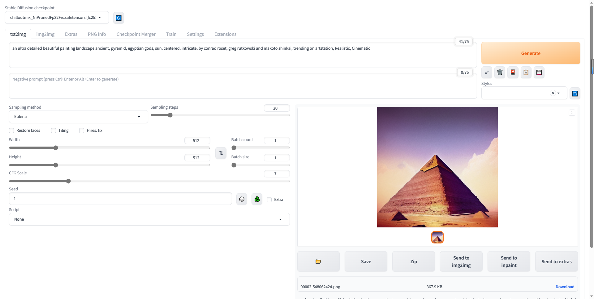

  **可以看到这副图与上一副还是有很大差异的，即使prompt都相同，因为seed取值-1的话是生成一个随机数，这个随机数会影响画面的内容。**

  > Prompt与Negative prompt就是大家口中的tag和反tag，这两个参数的作用原理其实是这样的。
  >
  > 人工智能模型在训练时候神经网络会包含很多参数，简单理解就是把一张图分解为许多元素。
  >
  > 每个元素出现的权重(也就是绘图时候画出来对应元素的概率)可以由Prompt进行正向的调节。
  >
  > Prompt可以作为元素权重的关键词，让AI更倾向于在绘图中绘制和Prompt的内容相关的元素，至于倾向性有多强，这个则是由CFG Scale进行调节，当然，AI能生成什么东西，至少这样东西的元素在训练集中已经有了，也就是说目前的AI还无法生成训练集中没有的元素，举个例子，假如训练集中没有林肯，那么即便输入林肯的脸这样的Prompt，也是无法让AI绘制出林肯的脸的。
  >
  > 那么很理所当然，要是想让AI生成自己需要的图，Prompt越详细，就越贴合需求。
  >
  > Prompt既可以使用非常详细的描述，也能使用比较大概的描述，例如既可以提供如:红色卷发这样比较详细的描述，也可以用红色头发这样的描述。
  >
  > 当然，前者生成红色卷发的概率就较高，后者也可以生成红色卷发，但是概率就较低。
  >
  > Negative Prompt则是和Prompt相反，是一个反向加权的权重关系，也就是减低某些元素出现的频率，从而约束AI的行为，例如我们可能不希望AI画出林肯的脸但是训练集中包含了林肯，这时候在Negative Prompt中添加林肯，AI就会不倾向于画出和林肯相关的全部元素，当然，如果是训练集都没有的，例如没有花生，那么即便添加了花生这个Negative Prompt也是没有意义的。

##### CFG scale

| 参数      | 说明                                                         |
| --------- | ------------------------------------------------------------ |
| CFG scale | AI 对描述参数（Prompt）的倾向程度。值越小生成的图片越偏离你的描述，但越符合逻辑；值越大则生成的图片越符合你的描述，但可能不符合逻辑。 |

- 首次输入
  `Prompt：an ultra detailed beautiful painting landscape ancient, pyramid, egyptian gods, sun, centered, intricate, by conrad roset, greg rutkowski and makoto shinkai, trending on artstation, Realistic, Cinematic`
  `CFG scale= 7`
  其余参数如图所示

  

  - `CFG scale = 15`
    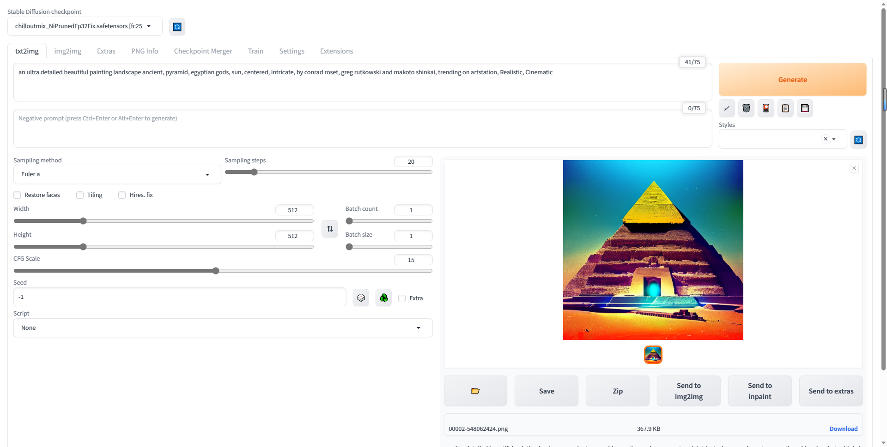

- `CFG scale = 20`
  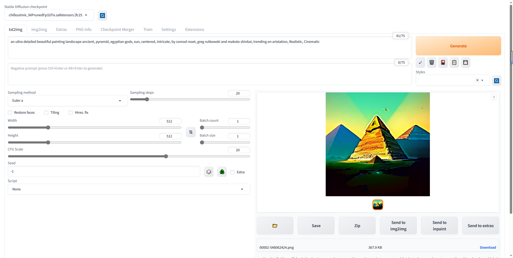
- `CFG scale = 25.5`
  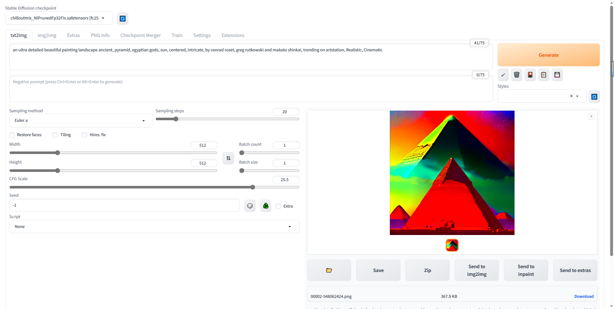
- **可以看到随着CFG scale 的增大，扩散引导就越强。输出的图像更加贴合prompt，但同时更加不合常理，生成的图片十分离谱。**

##### Sampling method

| 参数            | 说明                                                         |
| --------------- | ------------------------------------------------------------ |
| Sampling method | 采样方法。有很多种，但只是采样算法上有差别，没有好坏之分，选用适合的即可。 |

- 首次输入
  `Prompt：an ultra detailed beautiful painting landscape ancient, pyramid, egyptian gods, sun, centered, intricate, by conrad roset, greg rutkowski and makoto shinkai, trending on artstation, Realistic, Cinematic`
  `Sampling method：Euler a`
  其余参数如图所示

  

- `Sampling method：LMS`LMS:这个是最小均方误差算法,这是一个自适应的滤波器。
  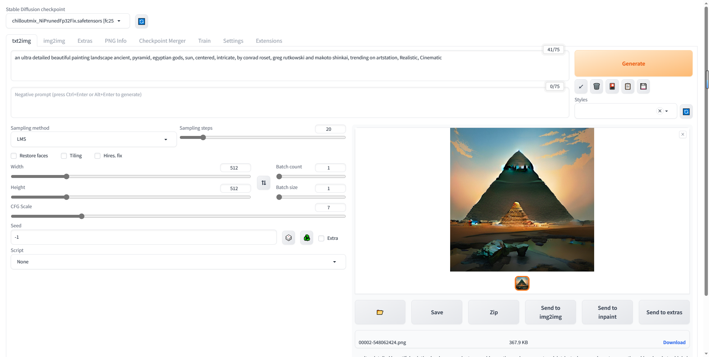

- `Sampling method：Heun`Heun:这个是建立在欧拉方法基础上的一个在给定初始条件下求解常微分方程的方法。
  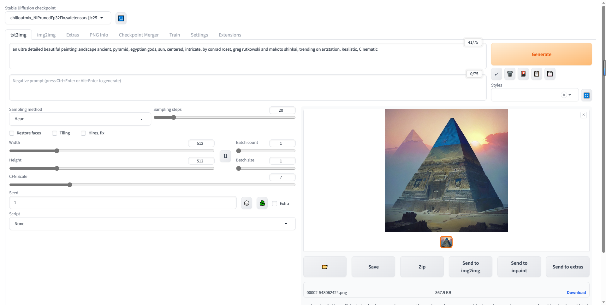

- `Sampling method：DPM`DPM:这是一个深度学习的PDE(偏微分方程)增强方法。
  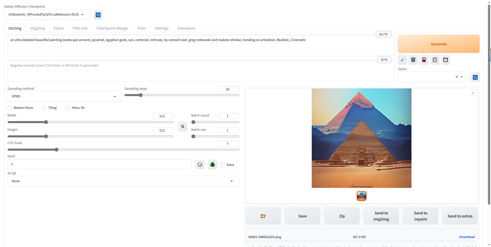

> 方法是很多，但是这些方法深究其原理意义不大，然而也没有绝对优秀的方法，即便是Euler加上一个a，或者其他方法加上一些例如fast,P,Karras什么的，也不过是指的以原方法为基础的改进方法，这些改进的方法往往对某方面特化了，更适合某方面的情景，这里我们提一下，没有一个完全通用于所有场景的最强最好最完美的算法，只有最合适的算法，这便是机器学习中那个没有免费午餐的说法，或者换句话说只要效果过得去，用哪个方法都一样。
>
> 所以**采样方法本身并没有绝对意义上的优劣之分，只有是否合适这一说。**
>
> 采样的目标是求解一个函数f(z)关于一个分布p(z)的期望，当然这个对于使用它并不重要，正如我们使用螺丝刀不需要去学习扭矩，力矩等等一样。
>
> 这里主要提一下以下几个方法:
>
> 欧拉方法:也就是Euler方法，是比较成熟的一种采样方法，效果比较稳定。
>
> 但是Novelai之所以有更好的效果并不是因为欧拉方法，而是因为DDIM即生成扩散模型，也就是stable diffusion主要采用的一种采样方法。
>
> 也就是说实际上DDIM在生成上具有优异的效果，当然，采样方法没有优劣之分，具有优异的效果并不意味着在任何时候用DDIM都可以取得最佳的效果，而且采样方法的选择对于结果的影响相对于接下来的参数较小，所以并不需要在这方面下太多功夫，随机选，如果不尽人意就换一个，如果能行就继续用，这样的态度就可以了。
>
> 这里可以提一下euler/a方法在风格转换上，特别是现实转图方面效果比较稳定。当然，还有几个方法效果同样稳定，反而是DDIM不怎么稳定。
>
> LMS:这个是最小均方误差算法,这是一个自适应的滤波器。
>
> Heun:这个是建立在欧拉方法基础上的一个在给定初始条件下求解常微分方程的方法。
>
> DPM:这是一个深度学习的PDE(偏微分方程)增强方法。
>
> 对于纯生成任务，采用DDIM效果相对较好，对于转换任务，采用euler和其改进型euler a都会有相对不错的效果，当然，其他方法的karras改进型效果也可以，但是非改进型效果往往不尽人意。

##### Sampling steps

| 参数           | 说明                                                         |
| -------------- | ------------------------------------------------------------ |
| Sampling steps | 采样步长。太小的话采样的随机性会很高，太大的话采样的效率会很低，拒绝概率高(可以理解为没有采样到,采样的结果被舍弃了)。 |

- 首次输入
  `Prompt：an ultra detailed beautiful painting landscape ancient, pyramid, egyptian gods, sun, centered, intricate, by conrad roset, greg rutkowski and makoto shinkai, trending on artstation, Realistic, Cinematic`
  `Sampling steps = 20`
  其余参数如图所示

  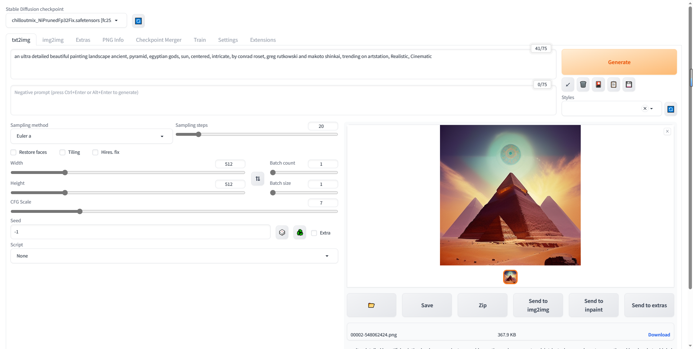

- `Sampling steps = 30`
  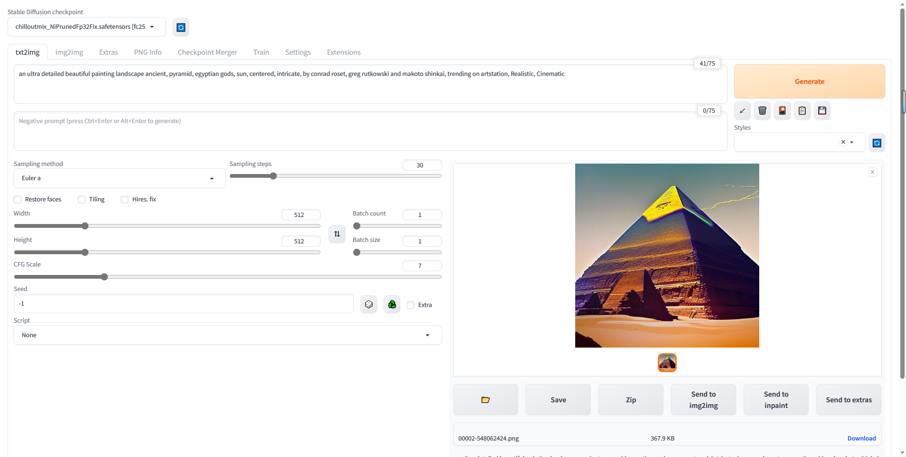

- `Sampling steps = 40`
  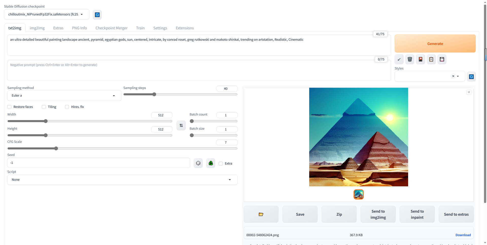

- `Sampling steps = 60`
  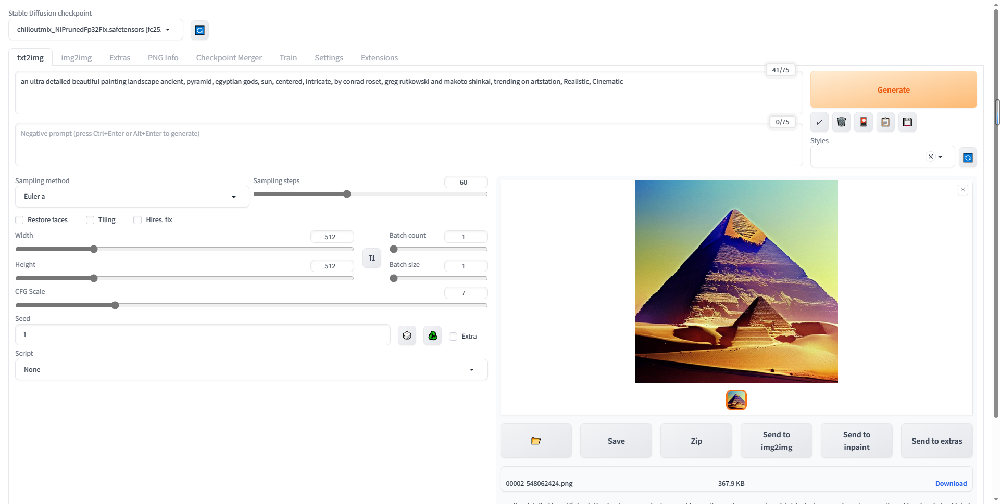

- `Sampling steps = 100`
  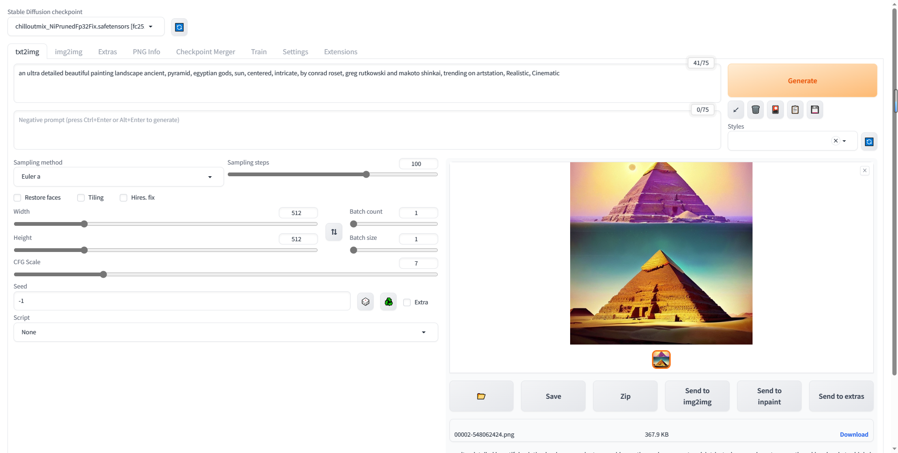

> 首先这个不是越大越好，同样也不是越小越好。
>
> 太小的话采样的随机性会很高，太大的话采样的效率会很低，拒绝概率高(可以理解为没有采样到,采样的结果被舍弃了)。
>
> 再通俗一点就是这个适当大一些的可以让画面内容更细致,小的话就没那么细致，但是太大也会和小的差不多，一般来说默认的20就不错了，想要追求更好的效果也可以适当大一些，例如30也可以。
>
> 图像长宽这个没什么好说的，但是可以提一下，这个大一些内容会更丰富，小的话例如64*64就只能画出半张脸或者一个眼睛。
>
> 当然，越大的就会越吃性能。

##### Seed

| 参数 | 说明                                                         |
| ---- | ------------------------------------------------------------ |
| Seed | 随机数种子。生成每张图片时的随机种子，这个种子是用来作为确定扩散初始状态的基础。不懂的话，用随机的即可。 |

- 首次输入
  `Prompt：an ultra detailed beautiful painting landscape ancient, pyramid, egyptian gods, sun, centered, intricate, by conrad roset, greg rutkowski and makoto shinkai, trending on artstation, Realistic, Cinematic`
  `Seed = -1`
  其余参数如图所示
  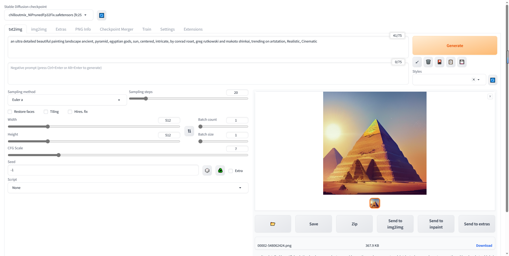

  

  

  **完全相同的输入，但是seed = -1，因为seed取值-1的话是生成一个随机数，这个随机数会影响画面的内容。**

- `seed = 3`
  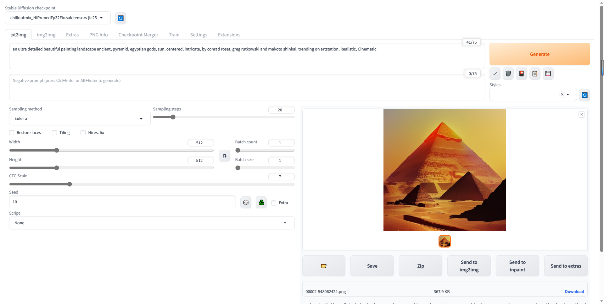
  

- `seed = 10`
  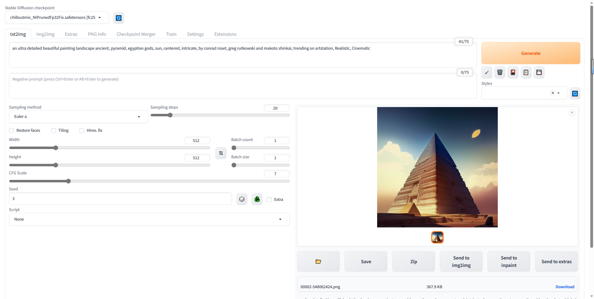
  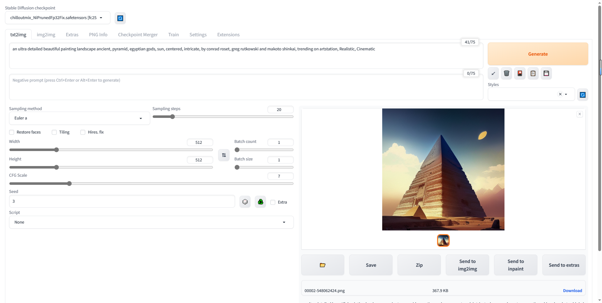

- **seed取固定值时生成的图像内容时完全相同的。**

> seed即为种子，-1的话是生成一个随机数，这个随机数影响画面的内容，如果seed以及Negative Prompt和Prompt都相同，生成几乎完全一致的图片的概率就很高，实际上这玩意是一个神经网络在当前情况下求得的一个最优解，设置了seed就相当于手动初始了神经网络的权重参数，在配合其他相同参数的情况下能得到一个极其类似的结果，当然，只设置seed而不设置其他的参数，还是无法得到类似的结果的。
>
> Variation seed和Variation strength这两个则是种子的变异，在原有权重参数初始极值的基础上再求解一次，简单可以理解成再原有种子的构图要素上发生一些改变，那么Variation seed如何设置的和原有种子一致，那么出图也是极其类似，Variation strength这个在Variation seed和原有种子完全一致的情况下不起作用。在不一致的情况下则会影响和原图的相似程度，如果Variation strength为0，这时候反而是Variation seed不起作用。
>
> 但是这里我们要注意Resize seed from width和Resize seed from hight，这两个在和原图长宽一致时或者为0时都不会对原图种子构成影响，但是若是不一致则会对原图产生极大的影响，至于影响有多大？相当于Variation seed为-1和Variation strength直接调成1的情况差不多，毕竟直接从不同长宽调整了种子。

#### 其余参数

##### web页面包含的三种优化技术

> Restore faces是优化面部的，原理是调用一个神经网络模型对面部进行修复，影响面部。
>
> Tiling是一种老牌优化技术，即CUDA的矩阵乘法优化，影响出图速度和降低显存消耗，不过实际选上之后可能连正常的图都不出来了。
>
> Highres. fix这个也是和上面的一样，都是一种优化技术，其原理是先在内部出低分辩率的图，再放大添加细节之后再输出出来，影响出图的结果，可以在低采样步长的情况下达到高采样步长的效果，但是如果采样步长过低(例如小于12)或者过高(例如高于100)以及长宽太小(例如小于128)效果则不尽人意，这个也有一个Denoising strength，只不过这个Denoising strength影响的只是内部的那个低分辨图，如果只是初次生成一张图这个可以不管，不过如果预设种子和参数一致的话这个就会对生成的图造成影响，也就是图会发生变化而不是原图更为精细。

##### Batch count和Batch size

> batch count和Batch size这个是出图的数量。只不过是顺序还是同时的区别。

##### Denoising strength

> Denoising strength可以简单理解成原图片的保留程度，其实是因为加的噪声少，原图片部分多，加的噪声多，原图片部分少，从而影响了AI的创作，越大就越不贴合原本的图片，越小就越贴合，大小的极值则对应完全保留和完全不保留两个极端。

### **模型：**

#### 模型下载与修改

从[civitai.com/](https://link.zhihu.com/?target=https%3A//link.juejin.cn/%3Ftarget%3Dhttps%3A%2F%2Fcivitai.com%2F) 和 [https://huggingface.co/](https://link.zhihu.com/?target=https%3A//huggingface.co/)可以下载模型，之后将模型导入models/Stable-diffusion目录下即可，在web UI的左上角可进行模型的切换。加载时间较长，等待加载结束后即可选择。

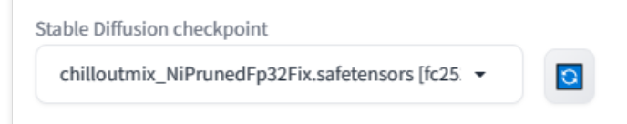

#### 不同模型效果展示

- 当设置相同的promts和参数时

` Prompt：a cute cat, cyberpunk art, by Adam Marczyński, cyber steampunk 8 k 3 d, kerem beyit, very cute robot zen, beeple | Negative prompt：(deformed, distorted, disfigured:1.3), poorly drawn, bad anatomy, wrong anatomy, extra limb, missing limb, floating limbs, (mutated hands and fingers:1.4), disconnected limbs, mutation, mutated, ugly, disgusting, blurry, amputation, flowers, human, man, woman CFG scale：6.5 Sampling method：Euler a Sampling steps：26 Seed：1791574510`

- 模型 **chilloutmix_NiPrunedFp32Fix.safetensors** 输出：

- 模型 **sd-v1-4.ckpt** 输出：

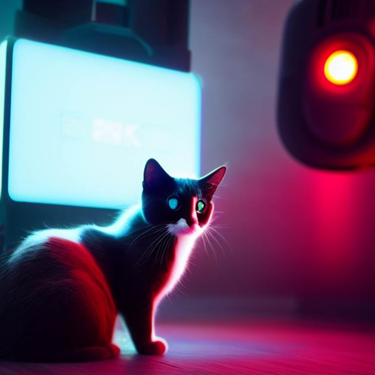

- 可以看到加载不同风格的模型时，即使输入相同的prompts，输出的结果差异仍然是巨大的。

## 五、总结与心得

### 运行webui-user.bat时

#### Pip版本问题

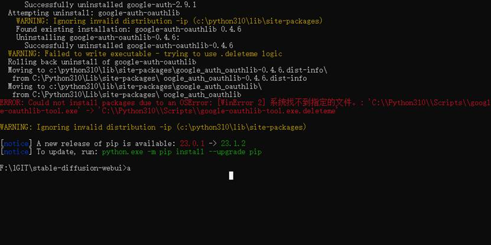

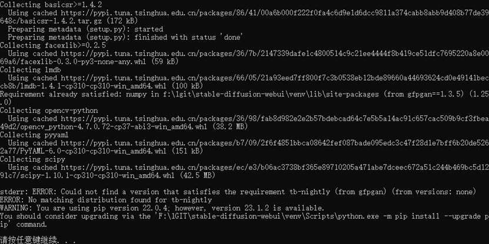

> 更新pip以解决

#### Tb-nightly无法下载

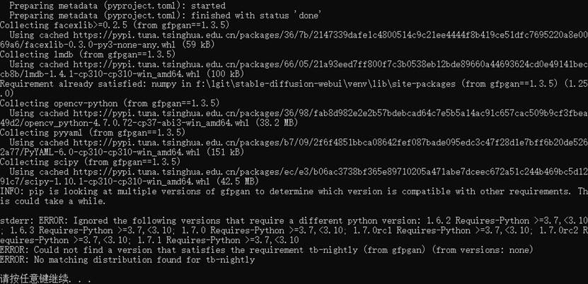

> 最令人抓狂的问题，一开始以为是python版本问题，之后改了半天才发现是清华源没有Tb-nightly……换了阿里源成功解决

#### 超时无法下载

>  还遇到了超时无法下载的问题，只好将相应的GitHub仓库手动下载放在对应的文件夹中。

## 六、参考资料

-  [AUTOMATIC1111/stable-diffusion-webui: Stable Diffusion web UI (github.com)](https://github.com/AUTOMATIC1111/stable-diffusion-webui)

- https://zhuanlan.zhihu.com/p/617997179
- [NovelAI模型各参数解析以及对应关系 - 知乎 (zhihu.com)](https://zhuanlan.zhihu.com/p/574063064)
- [How does Stable Diffusion work? - Stable Diffusion Art (stable-diffusion-art.com)](https://stable-diffusion-art.com/how-stable-diffusion-work/)
- [High-Resolution Image Synthesis with Latent Diffusion Models](https://openaccess.thecvf.com/content/CVPR2022/papers/Rombach_High-Resolution_Image_Synthesis_With_Latent_Diffusion_Models_CVPR_2022_paper.pdf)

