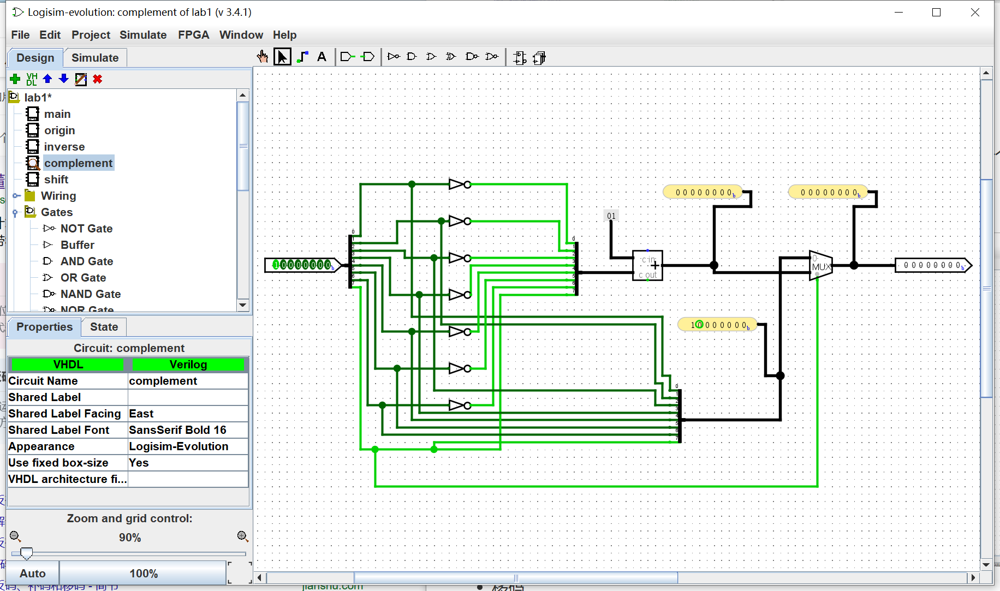

# 实验要求

> 设计和实现机器码生成电路，具体如下：
>
> ① 有一个8位输入端，代表8位二进制有符号整数，其中最高位为符号位。
>
> ② 设计4个子电路，能分别从输入的8位二进制有符号整数生成该数的原码、反码、补码及移码。
>
>    ③ 将产生的4个机器码作为多路选择器的输入，该多路选择器应有2个选择端，其不同取值（00,01,10,11）分别选择将原码、反码、补码及移码作为输出。整个电路封装成为主电路。
>
>   ④ 对生成的电路进行完备的测试。比如，要考虑正数、零、负数的情况。
>
>   ⑤ 如果加上一些修饰电路，会有额外的加分。比如，输入采用logisim-evolution提供的键盘进行；输入形式采用+1010011而不是11010011；在关键的地方加上探针，以便于显示测试结果；将输出送到数码管显示，等等。

# 操作流程

>本实验使用logisim-evolution v3.4.1，具体操作步骤由于版本不同可能有些差异

## 1 **创建四个子电路**

- 在菜单栏中单击“Project”，选择“Add Circuit”。创建四个子电路，分别命名为“origin”，“inverse”，“complement”和“shift”。

- 分别打开这四个子电路，为每个子电路添加一个8位输入端和一个8位输出端：
  - 右键单击项目栏中的子电路名称并选择“Edit Circuit”。
  - 在工具栏中选择“Wiring”库，点击“Pin”工具，然后在子电路画布上添加一个输入端和一个输出端。
  - 双击每个引脚以编辑它们的属性。将输入引脚的“Data Bits”设置为8，将“Output”选项取消勾选。将输出引脚的“Data Bits”设置为8，将“Output”选项勾选。

## 2 **设计四个子电路**：

- 原码：

  > 原码是其本身

  - 对于原码子电路，直接将输入端连接到输出端，因为原码就是输入的二进制数。

  

- 反码

  > 正数的反码是其本身，负数的反码是在其原码的基础上符号位不变，其余各个位取反。

  - 反码在反码子电路中，选择“Gates”库中的“NOT Gate”工具。
  - 在画布上添加7个NOT门，将输入端的后七位与相应的NOT门输入连接，然后将NOT门的输出连接到输出端。这样，输入的后7位都会被取反。**①**
  - 再将每一位的输入都加一个分支，直接输出原码。**②**
  - 添加“Multiplexer”工具，将“Data Bits”设置为8，将“Select Bits”设置为1。
  - 将符号位（第一位连接到）“Multiplexer”的select端，将①和②的输出分别连接到“Multiplexer”的1端和0端。

  

- 补码

  > 正数的补码就是其本身，负数的补码是在其反码的基础上+1

  - 在补码子电路中，复制反码子电路的设计。
  - 从“Arithmetic”库中选择“Adder”工具，将其添加到画布上。
  - 将反码中**①**的输出连接到加法器的一个输入端。
  - 创建一个8位常数，值为“00000001”，并将其连接到加法器的另一个输入端。
  - 将加法器的输出连接到**①**的输出端。

  

- 移码

  > 移码 将补码的符号位取反即可

  - 在移码子电路中，复制补码子电路的设计。

  - 选择“Gates”库中的“NOT Gate”工具。
  - 在画布上添加一个NOT门，将输入端的最高位与NOT门输入连接。

## 3 设计主电路 

- 在主电路中添加一个8位输入端和一个8位输出端，以及一个2位输入端：

- 将主电路中的输入端连接到子电路：

  - 在“Circuits”库中选择相应的子电路（原码、反码、补码、移码），将它们添加到主电路画布上。
  - 将8位输入端连接到每个子电路的输入端。

- 添加多路选择器

  - 从“Plexers”库中选择“Multiplexer”工具，将其添加到主电路画布上。
  - 双击多路选择器以编辑其属性。将“Data Bits”设置为8，将“Select Bits”设置为2。
  - 将2位输入端连接到多路选择器的选择端。
  - 将每个子电路的输出端连接到多路选择器的输入端。
  - 将多路选择器的输出端连接到8位输出端。

  

## 4 添加修饰电路：

- 在关键位置添加“Probe”工具以显示测试结果。
  - 从工具箱中找到“Wiring”库，选择“Probe”工具，并将其添加到电路画布上。
  - 单击并拖动`Probe`组件以将其连接到原码、补码、反码、移码的电路信号上。当连接`Probe`时，它将自动显示连接到该信号的值。

## 5 完备性测试

- 点击“Simulate”菜单并选择“Simulation Enabled”以启用仿真。使用不同的正数、零和负数输入值，观察主电路输出端的原码、反码、补码和移码是否正确。

- 输入`00010000`，选择码输入`11`（选择移码），输出`10010000`，`probe`分别输出原码为`00010000` ，反码为 `00010000` ，补码为`00010000`，移码为 `10010000` ，输出正确

  

- 输入`00000000`，选择码输入`01`（选择反码），输出`00000000`，`probe`分别输出原码为`00000000` ，反码为 `00000000` ，补码为`00000000`，移码为 `10000000` ，输出正确

- 输入`10000001`，选择码输入`10`（选择反码），输出`11111111`，`probe`分别输出原码为`10000001` ，反码为 `11111110` ，补码为`11111111`，移码为 `01111111` ，输出正确

# 实验结果

>完成上述步骤后，我得到了一个能够根据输入的8位二进制有符号整数生成原码、反码、补码和移码的电路。通过调整2位选择输入，可以在多路选择器中选择不同的机器码作为输出。

